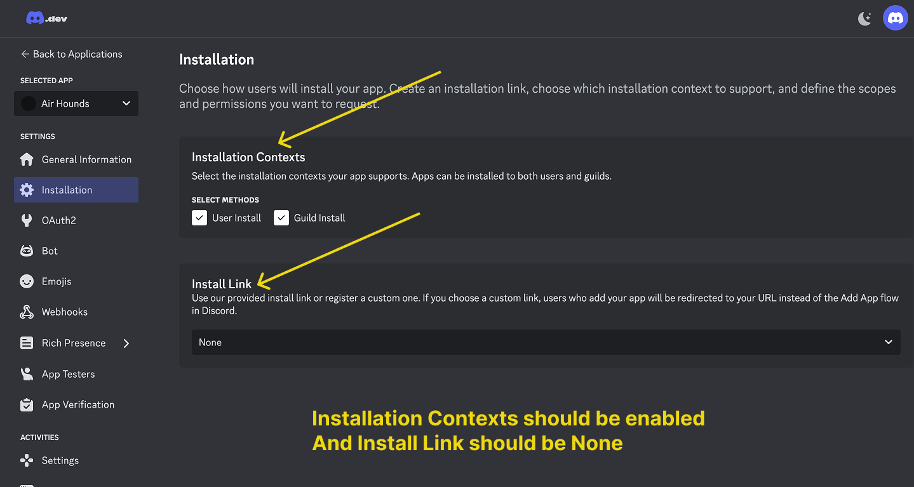

# Bot Personalizer

Give your bot a unique identity that matches your server's theme. You can either go for a **simple setup** (just change the avatar and nickname — no technical steps required) or a **full custom bot setup** using your own Discord bot token.

***

## Quick Customize (No Token Required)

Don't want to deal with the Discord Developer Portal? No problem. You can still give ClashPerk a personalized look on your server without creating a custom bot.

1. Run the `/bot-personalizer` command in your server.
2. Click the **Quick Customize** button.
3. A modal will appear — upload an avatar image and/or enter a nickname.
4. Submit the modal and the changes will apply instantly.

**Avatar requirements:** PNG, GIF, JPG, or WEBP · 1024×1024 (1:1 aspect ratio) · Max 10MB

This approach keeps things simple — no bot token, no emoji servers, and no technical setup needed.

***

## Full Custom Bot Setup (Token Required)

For a completely branded experience — your own bot name, avatar, and presence — you can connect a custom Discord bot using a token. This setup also requires inviting your bot to our 14 custom emoji servers so that game icons display correctly.


**Security Notice:** Your bot token is a highly sensitive credential. Never share it with anyone. If you suspect it has been compromised, reset it immediately from the Discord Developer Portal.


### How to Create and Set Up a Custom Bot

<figure><figcaption>
Step 1
</figcaption></figure>

<figure><figcaption>
Step 2
</figcaption></figure>

<figure><figcaption>
Step 3
</figcaption></figure>

<figure><figcaption>
Step 4
</figcaption></figure>

<figure><figcaption>
Step 5
</figcaption></figure>

<figure><figcaption>
Step 6
</figcaption></figure>

<figure><figcaption>
Step 7
</figcaption></figure>

<figure><figcaption>
Step 8
</figcaption></figure>

<figure><figcaption>
Step 9
</figcaption></figure>

<figure><figcaption>
Step 10
</figcaption></figure>

<figure><figcaption>
Step 11
</figcaption></figure>

<figure><figcaption>
Step 12
</figcaption></figure>

<figure><figcaption>
Step 12.5
</figcaption></figure>

<figure><figcaption>
Step 13
</figcaption></figure>

<figure><figcaption>
Step 14
</figcaption></figure>

<figure><figcaption>
Step 15
</figcaption></figure>

Finally, invite your custom bot to our emoji servers so it can display game icons properly. Join our [support server](https://discord.gg/ppuppun) to get the invite links to the emoji servers.
